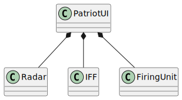

# Radar Assignment

## Building the Application
To compile the application, follow these steps:
```sh
mkdir build
cd build
cmake ..
make
```

## Running the Application
If you are not already in the `build` directory, navigate to it:
```sh
cd build
```
Then, run the application with the following command:
```sh
./src/assignment ../data/radar_data.csv
```

## Application Usage
Once the application starts, it will prompt you with available commands:
```
Available commands:
0. Quit
1. Start Simulation
```
To start the simulation, enter `1` when prompted:
```
Enter command: 1
```
The simulation will then begin and output the results.

### Example Output
```
Simulation started 1

Radar signal: 
0001010;0110011;0100110;0010000;0011100;0101101;1111010;1011101;0110100;1101011;0010011
Friend Target Detected

Radar signal: 
0111000;1101001;0011101;1000010;1010000;0011010;0110000;0010111;0101001;1001001;0010100
Friend Target Detected

Radar signal: 
1101001;1010110;0101100;0110011;0011000;1111101;0001100;0111110;0011010;0110110;1011111
Friend Target Detected

Radar signal: 
0111011;0100001;1001100;0010110;0010011;0100010;0110111;0101010;0101110;0000111;0110111
Hostile Target Detected
Missile Launched
Firing Result: 0.997509 -> Target Missed

Radar signal: 
0110100;1011111;0101101;1010111;1101011;0010001;1011111;1111010;0100100;1000110;0101010
Hostile Target Detected
Missile Launched
Firing Result: 0.496004 -> Target Neutralized

Radar signal: 
0100100;1111111;1100010;0111001;0111000;1010011;1100001;0010111;0111001;1000001;0110101
Hostile Target Detected
Missile Launched
```
## Exit Application
To exit the application, enter `0` at the command prompt.

## Software Design
